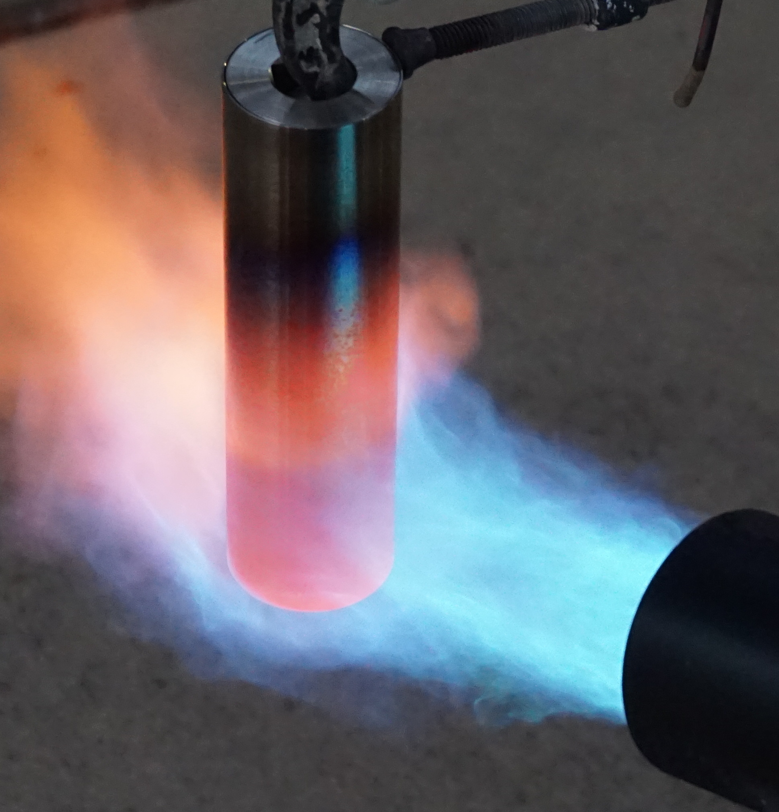
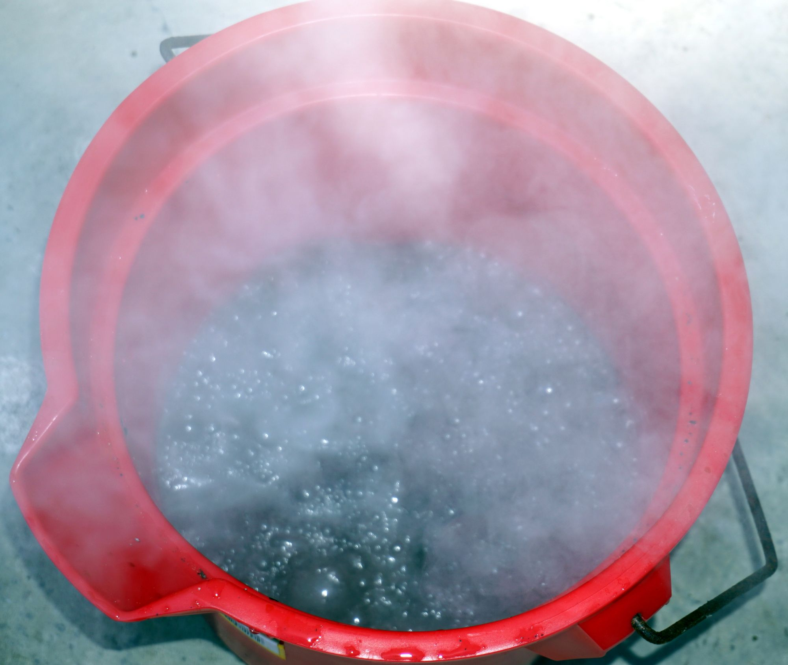
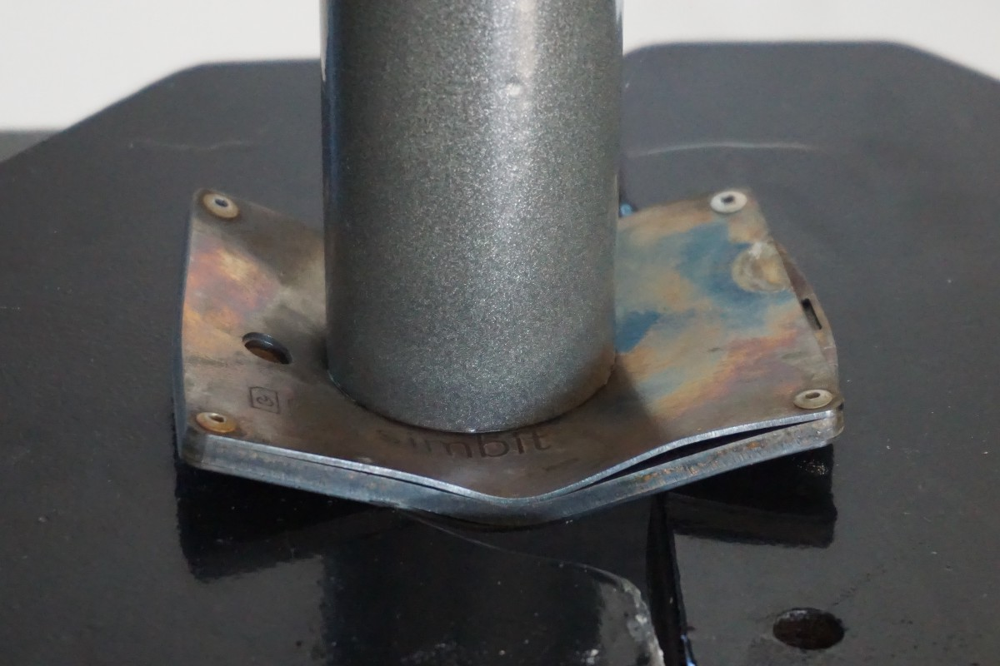

## Heat

In order to simulate slightly hotter than house fire temperatures, a <a href="https://www.amazon.com/Propane-Weed-Burner-Torch/dp/B001NDK8C8">large propane torch</a> is used to apply a 2000°F / 1093°C flame that is over 4" in diameter. This temperature was verified using a scientific thermometer with a high end sensor capable of reading temperatures up to 2500°F / 1371°C.

Heat is applied for 10 minutes or until device failure is observed. From my experience, if failure occurs during the heat test, it usually takes place around the 5 minute mark.

Finally, in order to simulate a house fire being extinguished by firefighters, the device is submerged into a bucket of water to quickly cool it down.

## Corrosion

The device is submerged in a bucket of 16% muriatic acid and left for 12 hours or until bubbling ceases. Are strong acids a threat vector you should be worried about? Probably not, but these tests are extreme in order to see which devices stand out from the pack!

## Crushing

A 20 ton hydraulic press is used to deform the device, after which the data is checked for readability. In some cases the device may need to be pried open or deformed further in order to access the data. Do you need to worry about this level of pressure? Probably not unless you’re keeping the device at the bottom of the Mariana Trench or in a structure that could collapse on top of it like a mine or a large building.

