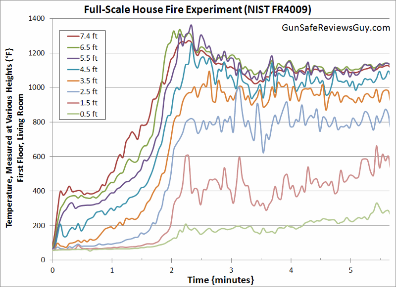
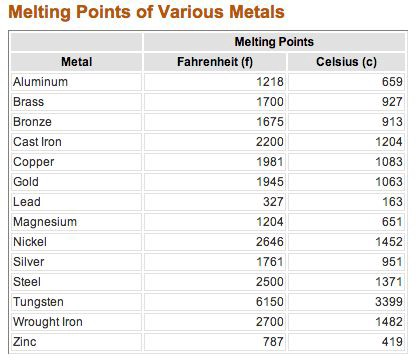
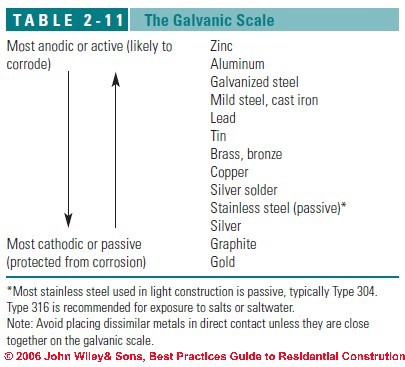
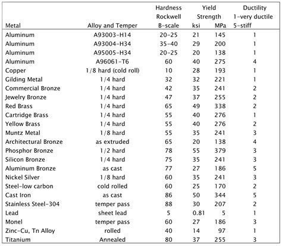

Storing wealth with private keys has changed the game when it comes to financial sovereignty. On one hand, they make it easy to store and transport. On the other hand, they make it easy to lose. Since private keys are just data, there are many ways to store a wallet seed — you’re only really limited by your creativity.

It has been estimated that <a href="https://coinmetrics.substack.com/p/coin-metrics-state-of-the-network-d2e">over 1,000,000 bitcoins have been lost</a>.

When you’re designing a cold storage solution, there are many potential loss vectors you should factor into your design.

## Stress Test: Heat
One of the most common form of loss in terms of natural disasters is in the form of house fires. There are over 300,000 house fires in the United States every year and house fire temperatures peak at around 1300°F / 704°C.

## Stress Test: Corrosion
Flooding is also a common form of natural disaster. People who live in low-lying areas or near bodies of water are prone to surges that result from storms. People who live in humid environments may also need to worry about corrosion.

Stainless steel seems to be the best readily-available metal for this application, but what might we expect in the future? <a href="https://www.youtube.com/watch?v=Bd370rlvT5M">Metallic glass</a> / amorphous metals are actually more durable and resistant to corrosion than your standard crystalline metals.

## Stress Test: Crushing

What if a fire / earthquake / tornado / other disaster results in your backup being crushed under the weight of tons of debris? Some metals are more malleable than others.

## Loss Via Physical Attack
You'’'ll want to physically secure against someone finding your seed phrase. If your phrase is an unencrypted seed for a single signature wallet, then an attacker finding it is a catastrophic loss scenario. You can mitigate this attack by either securing your data with an additional passphrase as described in <a href="https://github.com/bitcoin/bips/blob/master/bip-0038.mediawiki">BIP38</a> or <a href="https://github.com/bitcoin/bips/blob/master/bip-0039.mediawiki">BIP39</a>.

## Other Loss Vectors
Storing a single private key is not as safe as storing a 12 or 24 word HD seed. This is due to a potential loss scenario if you don’t sweep the entire wallet and much of the value goes to a change address for which you don’t save the private key. You can read more about this loss vector at "<a href="https://steemit.com/bitcoin/@michaelmatthews/warning-how-i-lost-bitcoins-using-a-paper-wallet">How I Lost Bitcoins Using a Paper Wallet</a>."

The common advice for wallet users is to never store your wallet seeds in a digital form. This is sound advice because the average user would be prone to either accidentally putting the digital file online where it could get compromised, or they may get malware on their computer that steals it, or they may simply not back up their device data and one day it dies or they throw it away without realizing that they should have backed up the data.

Essentially, ignorance and laziness are vectors worth considering — you are probably your own worst enemy unless you are well versed with and strict about maintaining top notch IT best practices. Don’t end up like James, who <a href="https://www.independent.co.uk/life-style/gadgets-and-tech/news/bitcoin-value-james-howells-newport-landfill-hard-drive-campbell-simpson-laszlo-hanyecz-a8091371.html">tried to get permission to dig up a landfill</a> to find tens of millions of dollars worth of bitcoins on a hard drive he threw away.